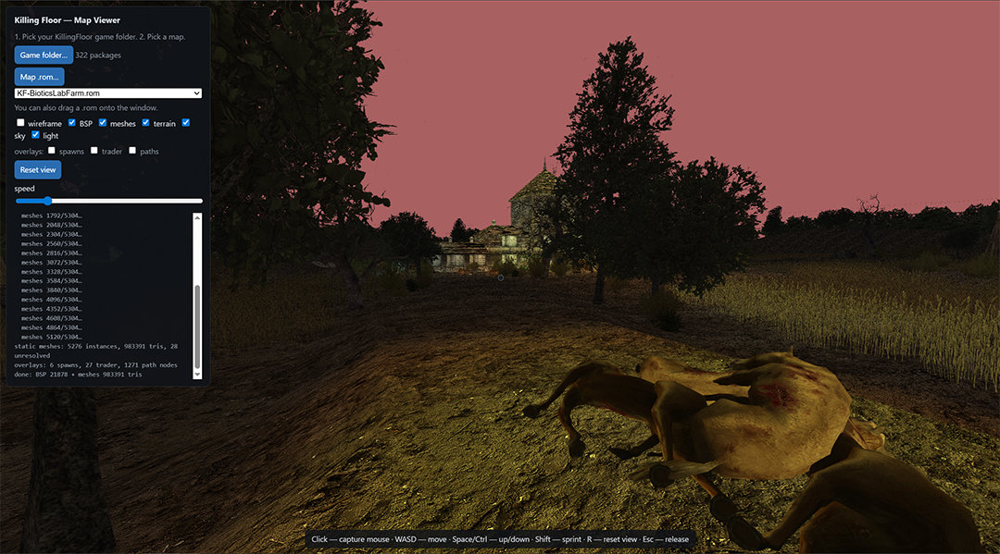

# Killing Floor Map Viewer

[English](../README.md) · **Русский** · [Español](./README.es.md) · [Português](./README.pt.md) · [Lietuvių](./README.lt.md) · [Polski](./README.pl.md) · [Français](./README.fr.md) · [中文](./README.zh.md) · [日本語](./README.ja.md)

Небольшой браузерный просмотрщик карт Killing Floor (`*.rom`, Unreal Engine 2.5). Рисует мир с текстурами и позволяет летать по нему свободной камерой — без запуска тяжёлого редактора KFEd. Формат `.rom` я разобрал вручную; подробности — в [`RESEARCH.ru.md`](./RESEARCH.ru.md).



## Что нужно

- Установленная игра **Killing Floor** (просмотрщик читает твои собственные файлы игры: карты `.rom` и лежащие рядом пакеты `.utx`/`.usx`).
- Свежий браузер на Chromium (Chrome / Edge) — используются File System Access (выбор папки) и расширение сжатых текстур S3TC.

Никакого игрового контента в репозитории нет. Просмотрщик указывает на твою собственную установку игры.

## Как пользоваться

1. Открой `viewer.html` (двойным кликом). Работает офлайн; Three.js вложен в `vendor/`.
2. Нажми **Game folder** и выбери корень установки KF (`…/common/KillingFloor`). Заранее индексируются только имена пакетов; `.utx`/`.usx` читаются по мере надобности.
3. Нажми **Map .rom** и выбери карту (или перетащи `.rom` в окно).

Управление: клик — захватить мышь, `WASD` — движение, `Space`/`Ctrl` — вверх/вниз, `Shift` — ускорение, `R` (или кнопка Reset view) — вернуться в стартовую точку, `Esc` — отпустить мышь.

В левой панели — переключатели `wireframe`, `BSP`, `meshes`, `terrain`, `sky` и `light`, плюс оверлеи `spawns`, `trader` и `paths` (точки спавна игроков, места торговца, path-ноды монстров) и ползунок скорости движения.

Что рисуется: мировой BSP (стены/пол/потолок), статик-меши (пропсы и детали — для CS-портов это почти вся геометрия) и террейн-хайтмап, всё с текстурами. Вырезающие текстуры (листва, решётки, заборы) используют alpha-test; стекло, дождь и прочие смешиваемые эффекты следуют blend-режиму материала. Скайбокс — это настоящая зона `SkyZoneInfo` карты, отрисованная как привязанный к камере задник, а поверхности-заглушки «окно в небо» отбрасываются, чтобы небо было видно сквозь них. Переключатель `light` запекает приблизительное освещение из акторов Light/Spotlight карты — по умолчанию выключен и это не точные запечённые лайтмапы игры.

Несколько шероховатостей перечислены в конце [`RESEARCH.ru.md`](./RESEARCH.ru.md). В частности: меши, чей `.usx` не установлен, пропускаются (видно в логе), а высота террейна берётся по стандартной формуле UE2 — так что если террейн карты выглядит слишком плоским или слишком высоким, крутить нужно делитель в коде.

## CLI (Node)

```bash
node cli.js <map.rom>            # package version, geometry counts, referenced texture packages
node cli.js <map.rom> out.obj    # + export the BSP as OBJ (opens in Blender / Windows 3D Viewer)
```

В OBJ есть позиции, грани и UV, но нет текстур — быстрый способ проверить геометрию в любом 3D-инструменте.

## Файлы

| Файл | Что это |
|------|---------|
| `viewer.html` | просмотрщик (Three.js + небольшая pointer-lock/WASD камера свободного полёта) |
| `kfrom.js` | ядро: разбор пакетов UE2.5, мировой BSP, статик-меши, террейн, текстуры (браузер и Node) |
| `cli.js` | Node CLI: статистика и экспорт в OBJ |
| `vendor/three.min.js` | Three.js r136 (вложен, чтобы просмотрщик работал офлайн) |
| `RESEARCH.ru.md` | заметки о формате `.rom` и о том, как просмотрщик его рисует |

## Лицензия

Проект распространяется под лицензией **MIT**. Полный текст — в [`LICENSE`](../LICENSE).

### Сторонние компоненты

- `vendor/three.min.js` — [three.js](https://threejs.org) r136, © авторы three.js, лицензия MIT. Вложен без изменений; его лицензионная нота сохранена в файле.

## Товарные знаки

Killing Floor и Unreal — товарные знаки их владельцев (Tripwire Interactive и Epic Games). Это неофициальный фанатский инструмент, не связанный с ними и не одобренный ими. Он не содержит игровых ассетов; он лишь читает файлы из уже имеющейся у тебя копии игры.
